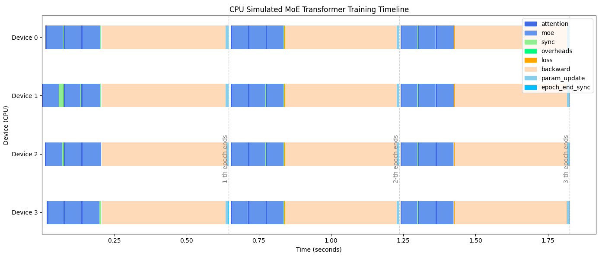

# Pytorch (Distributed) Data Parallel (ddp)

For large models that could not fit in one GPU, needs multiple GPUs to coordinate to compute forward and back propagation.

If a GPU waits for other GPUs to finish computation to sync data, the time slot for this idled GPU is called "bubble".

Typical coordination syncs are

* Batch normalization: the normalization term needs the sum of all batch data, if batch data is split into multiple GPUs, need to sync
* Loss computation: a model loss (assumed one loss per batch) needs all batch data to have done forward computation
* Parameter Updates: need to wait all layers all parameters had done gradient descent
* Some activation functions, e.g., softmax, needs a normalization term which is the sum of all results
* In MoEs structure, need to wait all GPUs having done computation of experts, only from which the TopK can get selected

For example, below trains a 3-layer moe+attention model for 3 epochs by CPUs to simulate data sync.
The lightgreen areas are bubbles that devices wait for other device to finish together they can proceed next computation.

      

 

The explicit 

## Pipeline Parallelism
