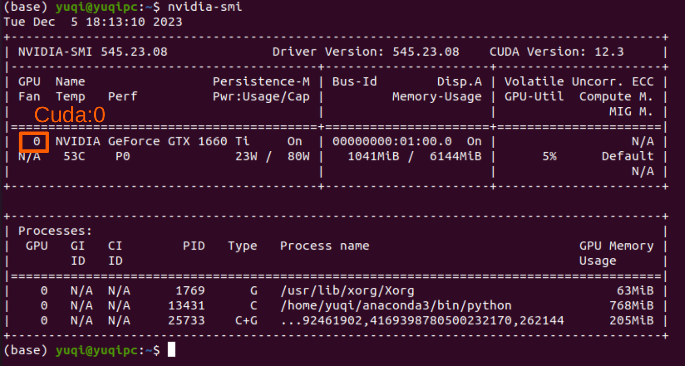

# PyTorch

## Some Prerequisites To Install

```sh
pip install -i https://pypi.tuna.tsinghua.edu.cn/simple torch torchaudio torchvision
pip install -i https://pypi.tuna.tsinghua.edu.cn/simple neural-compressor accelerate nvidia-ml-py3 evaluate

```

For one GPU scenario, run 
```python
import torch
device = "cuda:0" if torch.cuda.is_available() else "cpu"
```

### `bitsandbytes`

`bitsandbytes` is used for model quantization, but does not support Windows.

`bitsandbytes` version needs to be compatible with cuda version (by default Hugging Face may not choose a correct version to install), otherwise get `bnb` and its APIs missing definition.
For example, might get `AttributeError: module 'bitsandbytes.nn' has no attribute 'Linear8bitLt'`.

Check the installed CUDA version.

```python
import torch
torch.version.cuda # print '11.8'
```

Install the 11.8 cuda version compatible bitsandbytes.

```bash
git clone https://github.com/timdettmers/bitsandbytes.git
cd bitsandbytes

pip uninstall bitsandbytes

python -m bitsandbytes 
CUDA_VERSION=118 make cuda11x

python setup.py install
```

## CUDA Choice

PyTorch choice of CUDA and Nvidia GPU is not stable, that the below warning/error may show up.

```txt
UserWarning: CUDA initialization: CUDA unknown error - this may be due to an incorrectly set up environment, e.g. changing env variable CUDA_VISIBLE_DEVICES after program start. Setting the available devices to be zero. (Triggered internally at ../c10/cuda/CUDAFunctions.cpp:108.)
  return torch._C._cuda_getDeviceCount() > 0
```

The choice of cuda canbe found via bash `nvidia-smi`, where the number indicates available CUDA.

For example, by the below output, `device = "cuda:0"` can be used in PyTorch.

<div style="display: flex; justify-content: center;">
      
</div>
</br>

For 

## Some Frequently Used APIs

### Reshape-like APIs

* `view`

Does not change the underlying data structure/tensor memory layout, but only changes the data access order so that the tensor appears to be of a different tensor size.

* `reshape`

May return a copy or a `view` of the original tensor. 

* `contiguous`

Returns a `contiguous` in memory tensor containing the same data as self tensor.

Define a dimension index $d=1,2,...,k,...,D$ and cell entry index $i_d$ for the $d$-th dimension tensor, a `contiguous` should see cell retrieval of the $i_d$-th value on the $d=k$-th dimension by $\text{cell}(d=k, i_d) = \sum^{k-1}\_{d=1} \text{stride}_d + i_d \prod_{d=D}^{k+1} \text{stride}_d$, where $\text{stride}\_{k}=\prod_{d=D}^{k+1} \text{stride}_d$.

In other words, a `contiguous` tensor's cell can be accessed orderly with respect to its dimension index.

In the example below, `z = x[:, ::2]` passes the partial tensor out of order, hence `z` is not contiguous.
`z1=z.reshape(-1)` is passing by reference that `z1` has the same underlying data storage as that of `z`.
`x = torch.randn(3, 5, 7, 9)` has a stride of `(315, 126, 9, 1)`, for $315 = 3 \times 5 \times 7 \times 9 \times 1$ and $126 = 5 \times 7 \times 9 \times 1$, and so on.


```python
x = torch.randn(2, 4)
print(x.size(), x.stride())
# torch.Size([2, 4]) (4, 1)
print(x.is_contiguous())
# True

x1 = x.view(-1)
print(x1.size(), x1.stride())
# torch.Size([8]) (1,)
print(x1.is_contiguous())
# True

# To check if x and x1 share the same underlying data storage
print(id(x.data) == id(x1.data))
# print True, they share the same underlying data storage

x = torch.randn(3, 5, 7, 9)
z = x[:, ::2] # pass by reference
print(z.size(), z.stride())
# torch.Size([3, 3, 7, 9]) (315, 126, 9, 1)
print(z.is_contiguous())
# False
print(id(z.data) == id(x.data))
# print True, they share the same underlying data storage

z1 = z.view(-1)
# RuntimeError: view size is not compatible with input tensor's size and stride (at least one dimension spans across two contiguous subspaces). Use .reshape(...) instead.

z2 = z.reshape(-1) # pass by reference, i.e., by "view"
print(z2.is_contiguous())
# True
print(z2.size(), z2.stride())
# torch.Size([567]) (1,)
print(id(z.data) == id(z2.data))
# print True, they share the same underlying data storage
```

* `unsqueeze`

```python
x = torch.tensor([1, 2, 3, 4])

torch.unsqueeze(x, 0)
# print:
# tensor([[ 1,  2,  3,  4]])

torch.unsqueeze(x, 1)
# print:
# tensor([[ 1],
#         [ 2],
#         [ 3],
#         [ 4]])
```

* `permute`

```py
x = torch.randn(2, 3, 5)
x.size()
# torch.Size([2, 3, 5])
torch.permute(x, (2, 0, 1)).size()
# torch.Size([5, 2, 3])
```

* `transpose`

Transpose `dim0` vs `dim1`.

```python
x = torch.randn(2, 3, 5)
x.size()
# torch.Size([2, 3, 5])
torch.transpose(x, dim0=0, dim1=1)
# torch.Size([3, 2, 5])
```

### Gradients

* `zero_grad`

Sets gradients of all model parameters to zero.

Zeroing gradients is required when starting a new loop of training, but some training strategies accumulate gradients before applying to parameter updates, and such accumulated gradients should be zeroed.

* `no_grad`

In inference there is no need of storing gradients, since gradients are mostly useful in training for parameter update through  back-propagation.
This can save memory.

### NLP Wrappers


* `embedding`

Used to store word embeddings and retrieve them using indices. 

```python
embedding = nn.Embedding(30522, 768)
embedding([2013]) # get the 2013 token_id's embeddings
```
