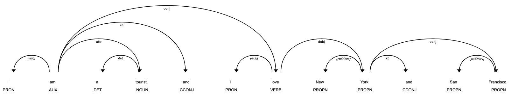
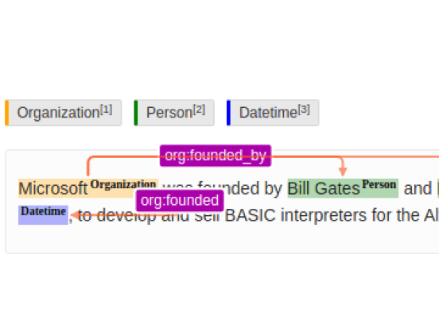

# Spacy

Spacy is an (small language model) NLP tool for text semantic comprehension, not for generative text response, e.g., by LLMs such as ChatGPT and LLAMA.
It is often used for Named Entity Recognition (NER) and syntactic parsing (build a grammar dependency tree).

## Pipeline

Having tokenized of texts, tokens are sent into this pipeline.

<div style="display: flex; justify-content: center;">
      
</div>
</br>

For example, below code shows `en_core_web_md-3.7.1` pipeline components.

```py
import spacy

# Load English tokenizer, tagger, parser and NER
nlp = spacy.load("en_core_web_md")

for pipe in nlp.pipe_names:
    print(nlp.get_pipe_config(pipe))
```

```jsonl
{'factory': 'tok2vec', 'model': {'@architectures': 'spacy.Tok2Vec.v2', 'embed': {'@architectures': 'spacy.MultiHashEmbed.v2', 'width': '${components.tok2vec.model.encode:width}', 'attrs': ['NORM', 'PREFIX', 'SUFFIX', 'SHAPE', 'SPACY', 'IS_SPACE'], 'rows': [5000, 1000, 2500, 2500, 50, 50], 'include_static_vectors': True}, 'encode': {'@architectures': 'spacy.MaxoutWindowEncoder.v2', 'width': 96, 'depth': 4, 'window_size': 1, 'maxout_pieces': 3}}}
{'factory': 'tagger', 'label_smoothing': 0.0, 'model': {'@architectures': 'spacy.Tagger.v2', 'nO': None, 'normalize': False, 'tok2vec': {'@architectures': 'spacy.Tok2VecListener.v1', 'width': '${components.tok2vec.model.encode:width}', 'upstream': 'tok2vec'}}, 'neg_prefix': '!', 'overwrite': False, 'scorer': {'@scorers': 'spacy.tagger_scorer.v1'}}
{'factory': 'parser', 'learn_tokens': False, 'min_action_freq': 30, 'model': {'@architectures': 'spacy.TransitionBasedParser.v2', 'state_type': 'parser', 'extra_state_tokens': False, 'hidden_width': 64, 'maxout_pieces': 2, 'use_upper': True, 'nO': None, 'tok2vec': {'@architectures': 'spacy.Tok2VecListener.v1', 'width': '${components.tok2vec.model.encode:width}', 'upstream': 'tok2vec'}}, 'moves': None, 'scorer': {'@scorers': 'spacy.parser_scorer.v1'}, 'update_with_oracle_cut_size': 100}
{'factory': 'attribute_ruler', 'scorer': {'@scorers': 'spacy.attribute_ruler_scorer.v1'}, 'validate': False}
{'factory': 'lemmatizer', 'mode': 'rule', 'model': None, 'overwrite': False, 'scorer': {'@scorers': 'spacy.lemmatizer_scorer.v1'}}
{'factory': 'ner', 'incorrect_spans_key': None, 'model': {'@architectures': 'spacy.TransitionBasedParser.v2', 'state_type': 'ner', 'extra_state_tokens': False, 'hidden_width': 64, 'maxout_pieces': 2, 'use_upper': True, 'nO': None, 'tok2vec': {'@architectures': 'spacy.Tok2Vec.v2', 'embed': {'@architectures': 'spacy.MultiHashEmbed.v2', 'width': 96, 'attrs': ['NORM', 'PREFIX', 'SUFFIX', 'SHAPE'], 'rows': [5000, 1000, 2500, 2500], 'include_static_vectors': True}, 'encode': {'@architectures': 'spacy.MaxoutWindowEncoder.v2', 'width': 96, 'depth': 4, 'window_size': 1, 'maxout_pieces': 3}}}, 'moves': None, 'scorer': {'@scorers': 'spacy.ner_scorer.v1'}, 'update_with_oracle_cut_size': 100}
```

### Component Explained

#### `tok2vec` and `spacy.Tok2Vec.v2`

* Served as the fundamental model for embedding, used by various other components/models, shared by `spacy.Tok2VecListener.v1` acted as wrapper
* Vector Representation: It produces dense vector representations for each token
* Contextualized Embeddings

#### `tagger` and `spacy.Tagger.v2`

* designed for part-of-speech (POS) tagging, for noun, verb, adjective, etc.
* Used `spacy.Tok2Vec.v2` for embedding through wrapper `spacy.Tok2VecListener.v1`
* Used `spacy.tagger_scorer.v1` for evaluation.

Reference: https://spacy.io/api/scorer

The scorer contains 

#### `parser` and `spacy.TransitionBasedParser.v2`

* Dependency Parsing: to analyze the syntactic structure, determining relationships between words and identifying dependencies.

For example, given "I am a tourist, and I love New York and San Francisco.", the parser result is

```txt
Token        Head         Dep        POS       
----------------------------------------
I            am           nsubj      PRON      
am           am           ROOT       AUX       
a            tourist      det        DET       
tourist      am           attr       NOUN      
,            am           punct      PUNCT     
and          am           cc         CCONJ     
I            love         nsubj      PRON      
love         am           conj       VERB      
New          York         compound   PROPN     
York         love         dobj       PROPN     
and          York         cc         CCONJ     
San          Francisco    compound   PROPN     
Francisco    York         conj       PROPN     
.            love         punct      PUNCT     
```

<div style="display: flex; justify-content: center;">
      
</div>

See https://explosion.ai/blog/parsing-english-in-python for syntactic dependency parsing background info.

The tag annotation is per Stanford annotation guidelines，
reference: https://downloads.cs.stanford.edu/nlp/software/dependencies_manual.pdf

#### `attribute_ruler`

* Add custom rules to transform texts with added lemma and pos.

#### `lemmatizer`

In linguistics, a *lemma* is the base or canonical form of a word.

For example,

* "running", "ran", "runs" -> "run"
* "eating", "ate", "eats" -> "eat"
* "best", "better" -> "good"

For spacy `lemmatizer`, there are

* Part-of-speech (POS) tags assigned to tokens to determine the correct lemma
* by 2024, not yet implemented model for training, but a lookup table/fixed rules
* Used `spacy.lemmatizer_scorer.v1` for evaluation

#### `ner`

* Named Entity Recognition (NER) uses `spacy.TransitionBasedParser.v2` for prediction
* The employed `spacy.TransitionBasedParser.v2` has different *transition actions* compared to the parser task

### Details of Tagger

The `spacy.Tagger.v2` simply takes vector embeddings of dim `n0` and feeds the embeddings into softmax, where the highest probability is considered the class/label.

```py
@registry.architectures("spacy.Tagger.v2")
def build_tagger_model(
    tok2vec: Model[List[Doc], List[Floats2d]], nO: Optional[int] = None, normalize=False
) -> Model[List[Doc], List[Floats2d]]:
    """Build a tagger model, using a provided token-to-vector component. The tagger
    model simply adds a linear layer with softmax activation to predict scores
    given the token vectors.

    tok2vec (Model[List[Doc], List[Floats2d]]): The token-to-vector subnetwork.
    nO (int or None): The number of tags to output. Inferred from the data if None.
    """
    # TODO: glorot_uniform_init seems to work a bit better than zero_init here?!
    t2v_width = tok2vec.get_dim("nO") if tok2vec.has_dim("nO") else None
    output_layer = Softmax_v2(
        nO, t2v_width, init_W=zero_init, normalize_outputs=normalize
    )
    softmax = with_array(output_layer)  # type: ignore
    model = chain(tok2vec, softmax)
    model.set_ref("tok2vec", tok2vec)
    model.set_ref("softmax", output_layer)
    model.set_ref("output_layer", output_layer)
    return model
```

#### POS Tagging Feature Extraction

Data Preprocessing:

* All words are lower cased;
* Digits in the range 1800-2100 are represented as !YEAR;
* Other digit strings are represented as !DIGITS
* It would be better to have a module recognising dates, phone numbers, emails, hash-tags, etc. but that will have to be pushed back into the tokenization.

Features of a token can be summarized as below (simply take surrounding tokens and their suffixes as contextual features).
The surrounding tokens are the nearest token in the dependency parsing tree of a sentence.

```py
def _get_features(self, i, word, context, prev, prev2):
    '''Map tokens into a feature representation, implemented as a
    {hashable: float} dict. If the features change, a new model must be
    trained.
    '''
    def add(name, *args):
        features[' '.join((name,) + tuple(args))] += 1

    i += len(self.START)
    features = defaultdict(int)
    # It's useful to have a constant feature, which acts sort of like a prior
    add('bias')
    add('i suffix', word[-3:])
    add('i pref1', word[0])
    add('i-1 tag', prev)
    add('i-2 tag', prev2)
    add('i tag+i-2 tag', prev, prev2)
    add('i word', context[i])
    add('i-1 tag+i word', prev, context[i])
    add('i-1 word', context[i-1])
    add('i-1 suffix', context[i-1][-3:])
    add('i-2 word', context[i-2])
    add('i+1 word', context[i+1])
    add('i+1 suffix', context[i+1][-3:])
    add('i+2 word', context[i+2])
    return features
```

Scores are computed as summed weights per class (a naive solution for explanation).
Ideally after training, weight/embedding length should be proportional to linguistic "similarity" of a token, hence, summed weights can be used as scores.

```py
scores = defaultdict(float)
for feat in features:
    if feat not in self.weights:
        continue
    weights = self.weights[feat]
    for clas, weight in weights.items():
        scores[clas] += weight
```

### Part-of-Speech (POS) Tagger vs Named Entity Recognizer (NER), and Dependency

* POS Tagger

Common tags include nouns, verbs, adjectives, etc.

Example:

```txt
Input: "I like blue ham."
Output: [('I', 'PRON'), ('like', 'VERB'), ('blue', 'ADJ'), ('ham', 'NOUN')]
```

* NER

Common predefined categories such as persons, organizations, locations, dates, etc.

Example:

```txt
Input: "Barack Obama was born in Hawaii."
Output: [('Barack Obama', 'PERSON'), ('Hawaii', 'GPE')]
```

#### Integration of Dependency Parsing

To enhance both POS tagging and NER, dependency parsing can be incorporated into the training pipeline to increase accuracy by leveraging the advantage of contextual understanding and syntactic structure of text inputs.

### Details of Parser

The `spacy.TransitionBasedParser.v2` can perform NER or dependency-parsing tasks.
Different tasks see different `nr_feature_tokens`.

```py
if state_type == "parser":
    nr_feature_tokens = 13 if extra_state_tokens else 8
elif state_type == "ner":
    nr_feature_tokens = 6 if extra_state_tokens else 3
```

`lower`: Construct a feature-specific vector for each (token, feature) pair.
Typically, there are

* `nO=hidden_width`: dim per input token, e.g., 64
* `nI=tok2vec.get_dim("nO")`: input dim of `X`, same as `hidden_width`
* `nF=nr_feature_tokens`: num of other dependent tokens per this input token, e.g., 8 or 3
* `nP=maxout_pieces`: max output tokens, e.g., 2

```py
lower = _define_lower(
    nO=hidden_width if use_upper else nO,
    nF=nr_feature_tokens,
    nI=tok2vec.get_dim("nO"),
    nP=maxout_pieces,
)

def _define_lower(nO, nF, nI, nP):
    return PrecomputableAffine(nO=nO, nF=nF, nI=nI, nP=nP)
```

A forward of `PrecomputableAffine` is defined as below,
where `model.ops.gemm(X, W.reshape((nF * nO * nP, nI))` is a General Matrix Multiplication (GEMM) operation, a matrix multiplication where $X \in \mathbb{R}^{n \times nI}$ and $W^{\top} \in \mathbb{R}^{nI \times (nF \times n0 \times nP)}$ whose multiplication result is $Y \in \mathbb{R}^{n \times nF \times n0 \times nP}$, where $n$ is the number of total input tokens.

```py
def PrecomputableAffine(nO, nI, nF, nP, dropout=0.1):
    model = Model(
        "precomputable_affine",
        forward,
        init=init,
        dims={"nO": nO, "nI": nI, "nF": nF, "nP": nP},
        params={"W": None, "b": None, "pad": None},
        attrs={"dropout_rate": dropout},
    )
    return model

def forward(model, X, is_train):
    nF = model.get_dim("nF")
    nO = model.get_dim("nO")
    nP = model.get_dim("nP")
    nI = model.get_dim("nI")
    W = model.get_param("W")
    # Preallocate array for layer output, including padding.
    Yf = model.ops.alloc2f(X.shape[0] + 1, nF * nO * nP, zeros=False)
    model.ops.gemm(X, W.reshape((nF * nO * nP, nI)), trans2=True, out=Yf[1:])
    Yf = Yf.reshape((Yf.shape[0], nF, nO, nP))

    # Set padding. Padding has shape (1, nF, nO, nP). Unfortunately, we cannot
    # change its shape to (nF, nO, nP) without breaking existing models. So
    # we'll squeeze the first dimension here.
    Yf[0] = model.ops.xp.squeeze(model.get_param("pad"), 0)

    return Yf
```

### Spacy Transitional Model (Parser) Implementation

#### Head Indices

Spacy parser takes as input a list of string tokens, and outputs a list of head indices.
The head indicies, e.g., $i$ indicates the i-th token of a sentence, and same for $j$, are used to mark an edge/transition between two tokens $(i,j)$.

#### Best Transition Prediction by Shift

```py
class Parser(object):
    ...
    def parse(self, words):
        tags = self.tagger(words)
        n = len(words)
        idx = 1
        stack = [0]
        deps = Parse(n)
        while stack or idx < n:
            features = extract_features(words, tags, idx, n, stack, deps)
            scores = self.model.score(features)
            valid_moves = get_valid_moves(i, n, len(stack))
            next_move = max(valid_moves, key=lambda move: scores[move])
            idx = transition(next_move, idx, stack, parse)
        return tags, parse

def get_valid_moves(i, n, stack_depth):
    moves = []
    if i < n:
        moves.append(SHIFT)
    if stack_depth <= 2:
        moves.append(RIGHT)
    if stack_depth <= 1:
        moves.append(LEFT)
    return moves
```

#### Training and Weight Update

```py
class Parser(object):
    ...
    def train_one(self, itn, words, gold_tags, gold_heads):
        n = len(words)
        i = 2; stack = [1]; parse = Parse(n)
        tags = self.tagger.tag(words)
        while stack or (i + 1) < n:
            features = extract_features(words, tags, i, n, stack, parse)
            scores = self.model.score(features)
            valid_moves = get_valid_moves(i, n, len(stack))
            guess = max(valid_moves, key=lambda move: scores[move])
            gold_moves = get_gold_moves(i, n, stack, parse.heads, gold_heads)
            best = max(gold_moves, key=lambda move: scores[move])
        self.model.update(best, guess, features)
        i = transition(guess, i, stack, parse)
    # Return number correct
    return len([i for i in range(n-1) if parse.heads[i] == gold_heads[i]])
```

## Spacy Training

### Practice

#### Data Preparation

https://spacy.io/api/docbin

The binary `.spacy` format is a serialized `DocBin`.
The serialization format is gzipped msgpack having the below format.

```py
{
    "version": str,           # DocBin version number
    "attrs": List[uint64],    # e.g. [TAG, HEAD, ENT_IOB, ENT_TYPE]
    "tokens": bytes,          # Serialized numpy uint64 array with the token data
    "spaces": bytes,          # Serialized numpy boolean array with spaces data
    "lengths": bytes,         # Serialized numpy int32 array with the doc lengths
    "strings": List[str]      # List of unique strings in the token data
}
```

New data can be added by below.

```py
import spacy
from spacy.tokens import Doc, DocBin

nlp = spacy.blank("en")
docbin = DocBin()
words = ["Apple", "is", "looking", "at", "buying", "U.K.", "startup", "."]
spaces = [True, True, True, True, True, True, True, False]
ents = ["B-ORG", "O", "O", "O", "O", "B-GPE", "O", "O"]
doc = Doc(nlp.vocab, words=words, spaces=spaces, ents=ents)
docbin.add(doc)
docbin.to_disk("./train.spacy")
```

In a more practical solution, use 3rd party labelling software, e.g., `label-studio` or `prodigy`, then convert into spacy format.

<div style="display: flex; justify-content: center;">
      
</div>

https://labelstud.io/guide/export#spaCy

#### Training

Reference:

https://spacy.io/usage/training

### Spacy Custom Training Pipeline


### Tagging vs NER

## Q&A

* `factory` vs `component`