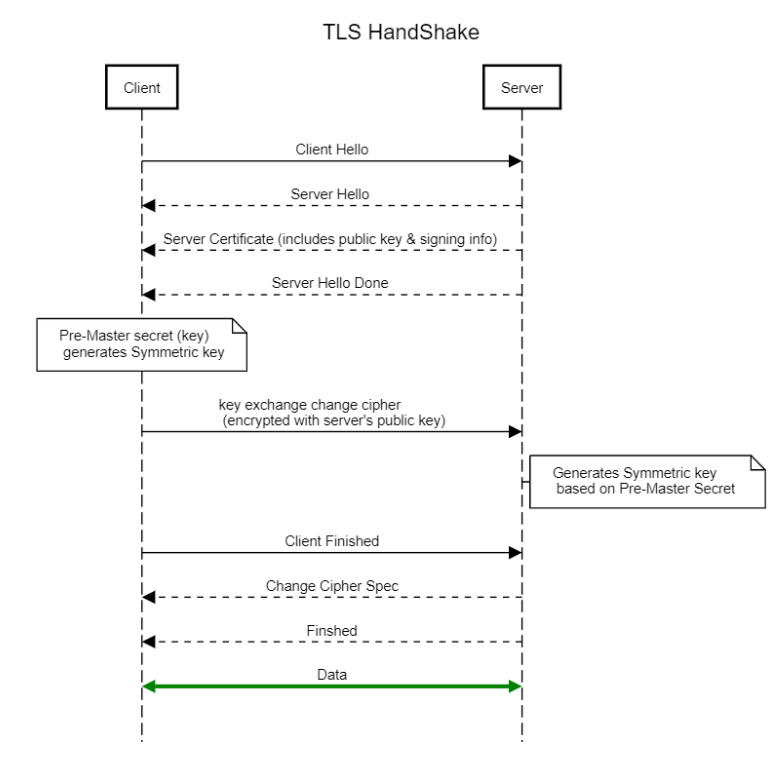
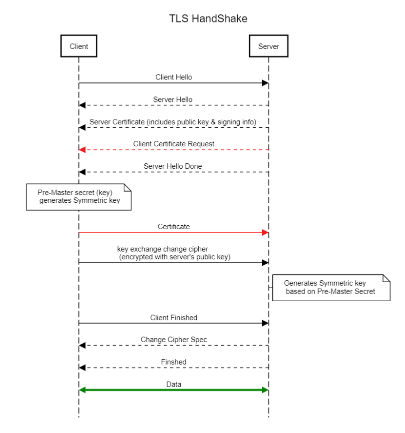

# Certs and Secure Tunneling

## SSL 

`SSH tunneling` is a method of transporting arbitrary networking data over an encrypted SSH connection.

**SSL** stands for Secure Socket Layer.

The client contacts the server and sends the first message. The first message causes the client and server to exchange a few messages to negotiate the encryption algorithm to use and to pick an encryption key to use for this connection. Then the client's data is sent to the server. After this is done the client and the server can exchange information at will.

An asymmetric cryptography:

A symmetric cryptography:

An SSL handshake:

1. Hello messages contain SSL version number, cipher settings, session-specific data, etc. (browser receives the certificate served as a **public key**)
2. The client verifies the server's SSL certificate from **CA (Certificate Authority)** and authenticates the server (CA uses **private key** to perform verification)
3. The client creates a session key, encrypts it with the server's public key and sends it to the server
4. The server decrypts the session key with its private key and sends the acknowledgement

After a successful handshake, data is transferred with session key encryption.

## TLS

Transport Layer Security (TLS) is a successor of SSL, with most publicly visible use case of https.

The process is illustrated as below, that
1. Hello includes information about itself such as the ciphers it supports and the TLS versions it supports
2. a pre-master secret is calculated by the server's public key extracted from its cert, meanwhile, a symmetric key is generated
3. Server generates same symmetric key and switches to using symmetric key encryption

TLS is different from SSL in terms of 
1. Cipher suites
2. Alert messages
3. Hash algos
4. Certificate format 

**CRL** 

a certificate revocation list (or CRL) is "a list of digital certificates that have been revoked by the issuing certificate authority (CA) before their scheduled expiration date and should no longer be trusted".

**TLS Certificate**

X.509 is a standard defining the format of public key certificates.

### mTLS

On mTLS, both client and server need to present certificates issued by a CA, and verify whether the certificates are valid.

## Certificate

A certificate is a container of a public key, with added info such as issuer, experation time, encryption algo, etc:

* Version: A value (1, 2, or 3) that identifies the version number of the certificate
* Serial Number: A unique number for each certificate issued by a CA
* CA Signature Algorithm: Name of the algorithm the CA uses to sign the certificate contents
* Issuer Name: The distinguished name (DN) of the certificate's issuing CA
* Validity Period: The time period for which the certificate is considered valid
* Subject Name: Name of the entity represented by the certificate
* Subject Public Key Info: Public key owned by the certificate subject

Some common used extensions include:

* .crt, .pem - (Privacy-enhanced Electronic Mail) Base64 encoded DER certificate, enclosed between "-----BEGIN CERTIFICATE-----" and "-----END CERTIFICATE-----"
* .der, .cer - usually in binary DER  (Distinguished Encoding Rules) form

**Chian of trust**

Certificate Authorities (CAs) is a third-party that has already been vouched for trust by client and server. There are root CAs and intermediate CAs (any certificate that are in between CA and clients), and leaf certificate for end client.

**Certificate signing request (CSR)**

A CSR is an encoded message submitted by an applicant to a CA to get an SSL certificate. CSR identifies a client by its distinguished name (DN).

A CSR is sent to a CA and CA signs this CSR and return a certificate (containing a client's public key and client DN) and a client private key.

**Signature**

A Certificate Signature (or Certificate Fingerprint) field is computed from Hash from the Cryptographic Hash Function of the whole Certificate using the identified Certificate Signature Algorithm. 

**fingerprint**

In OpenSSL the "-fingerprint" option takes the hash of the DER encoded certificate.

To check fingerprint, first convert into .der then hash it and return the result.
`openssl x509 -in cert.crt -outform DER -out cert.cer`
`sha1sum cert.cer`

**openssl examples**
* private key generation:
`openssl genpkey -algorithm RSA -pkeyopt rsa_keygen_bits:2048 -out private-key.pem`

* corresponding public key generation
`openssl pkey -in private-key.pem -out public-key.pem -pubout`

* generating CSR
`openssl req -newkey rsa:2048 -subj "/C=US/ST=Oregon/L=Portland/O=Company Name/OU=Org/CN=www.example.com" -keyout PRIVATEKEY.key -out MYCSR.csr`

* check cert chain
`openssl s_client -connect <hostname:port> -showcerts`